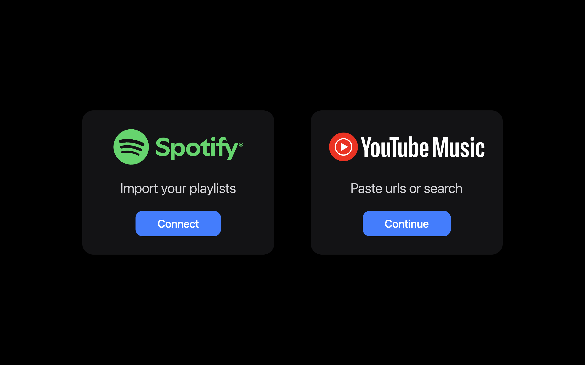
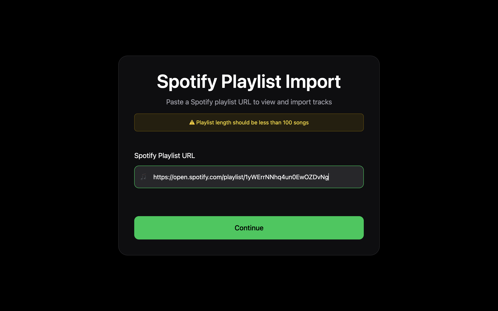
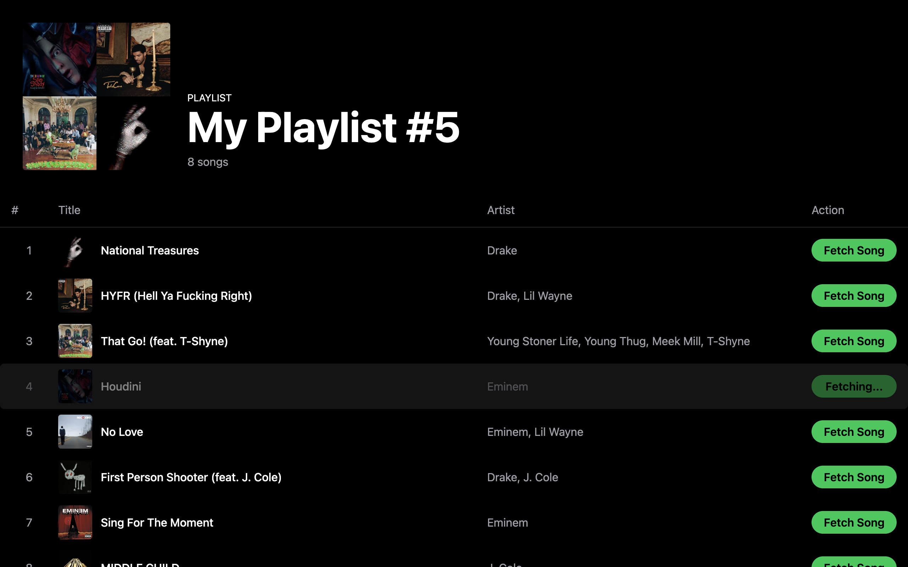
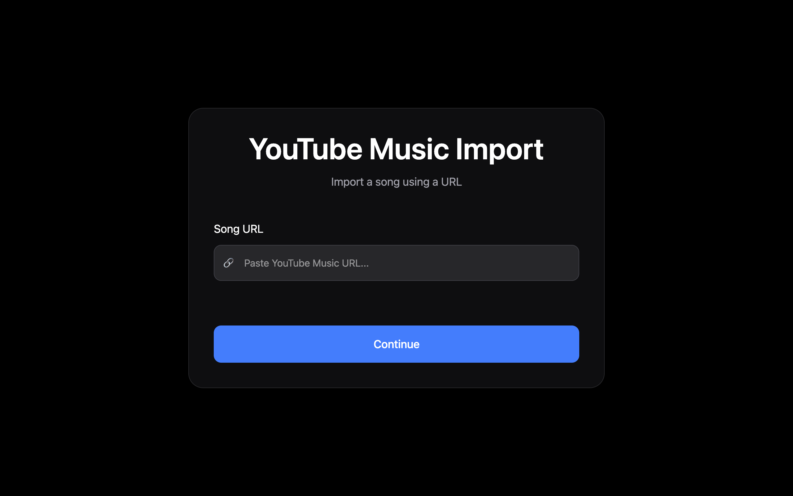

# 🎵 Spotify Playlist Downloader

A full-stack application that allows users to paste a Spotify playlist URL and download individual tracks as MP3 files or dirctly paste the song URL from Youtube Music.

The application:

* Fetches playlist information from Spotify
* Displays playlist metadata and tracks
* Searches YouTube Music for matching songs
* Downloads songs as MP3 files using yt-dlp and FFmpeg
* Supports one-command deployment using Docker

---

## Features

* 🎶 Fetch Spotify playlists using a playlist URL
* 📋 Display playlist details and track information
* 🔍 Automatic song matching through YouTube Music
* ⬇️ Download tracks as MP3 files
* ⚡ Fast React + Express architecture

---
## Application Flow

### 1. Choose Import Method



### 2. Import Spotify Playlist

Paste a public Spotify playlist URL to fetch playlist information and tracks.



### 3. Browse Playlist Tracks

View all songs in the playlist and select tracks to download.



### 4. Download Songs


Tracks are automatically matched through YouTube Music and downloaded as MP3 files.

### 5. Direct YouTube Music Import

Users can also paste a YouTube Music song URL and download tracks directly.



---

## 🐳 Running with Docker (Recommended)

Clone the repository:

```bash
git clone https://github.com/atharv170705/SpotifyMusicDownloader.git
cd SpotifyMusicDownloader
```

Create a `.env` file inside the backend folder:

```env
PORT=5003
CORS_ORIGIN=http://localhost:5173
```

Build and start the application:

```bash
docker compose up --build
```

Open:

```text
http://localhost:5173
```

The application will run without needing to manually install:

- Node.js
- FFmpeg
- yt-dlp
- Python

Docker handles all required dependencies automatically.

### Stopping the Application

```bash
docker compose down
```

---

# Manual Installation (Without Docker)

## Node.js

Install Node.js (v18+ recommended):

https://nodejs.org

Verify installation:

```bash
node -v
npm -v
```

---

## FFmpeg

### macOS

Install Homebrew if not already installed:

```bash
/bin/bash -c "$(curl -fsSL https://raw.githubusercontent.com/Homebrew/install/HEAD/install.sh)"
```

Install FFmpeg:

```bash
brew install ffmpeg
```

### Windows

Install FFmpeg using Winget:

```powershell
winget install Gyan.FFmpeg
```

Verify installation:

```powershell
ffmpeg -version
```

---

## yt-dlp

### macOS

```bash
brew install yt-dlp
```

### Windows

Install yt-dlp using Winget:

```powershell
winget install yt-dlp.yt-dlp
```

Verify installation:

```powershell
yt-dlp --version
```


---

## Getting Started

### Clone the Repository

```bash
git clone https://github.com/atharv170705/SpotifyMusicDownloader.git
cd SpotifyMusicDownloader
```

---

### Backend Setup

Navigate to the backend folder:

```bash
cd backend
```

Create a `.env` file and add:

```env
PORT=5003
CORS_ORIGIN=http://localhost:5173
```

> Make sure the frontend runs on the same port specified in `CORS_ORIGIN` and the backend on the port `5003`.

Install dependencies:

```bash
npm install
```

Start the backend:

```bash
npm run dev
```

---

### Frontend Setup

Open a new terminal and navigate to the frontend folder:

```bash
cd frontend
```

Install dependencies:

```bash
npm install
```

Start the frontend:

```bash
npm run dev
```

---

## Running the Application

After both servers are running, open:

```text
http://localhost:5173
```

Paste a Spotify playlist URL and start downloading songs.

---

## Tech Stack

### Frontend

* React
* React Router
* Axios
* Tailwind CSS

### Backend

* Node.js
* Express.js

### Music Services

* Spotify Playlist Data (`spotify-url-info`)
* YouTube Music Search (`ytmusic-api`)
* yt-dlp
* FFmpeg

### DevOps

* Docker
* Docker Compose

---

## Project Structure

## Project Structure

```bash
SpotifyMusicDownloader/
├── docker-compose.yml
│
├── frontend/
│   ├── Dockerfile
│   ├── .dockerignore
│   ├── src/
│   ├── public/
│   └── package.json
│
├── backend/
│   ├── Dockerfile
│   ├── .dockerignore
│   ├── src/
│   ├── .env
│   └── package.json
│
├── .gitignore
└── README.md
```

---

# Disclaimer

This project is intended for educational and personal use. Users are responsible for complying with the Terms of Service of any third-party platforms they interact with.

---

## License

MIT
